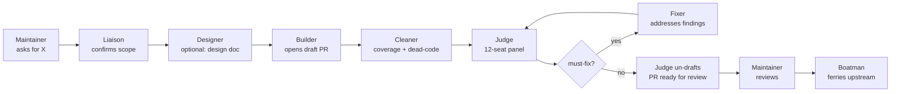
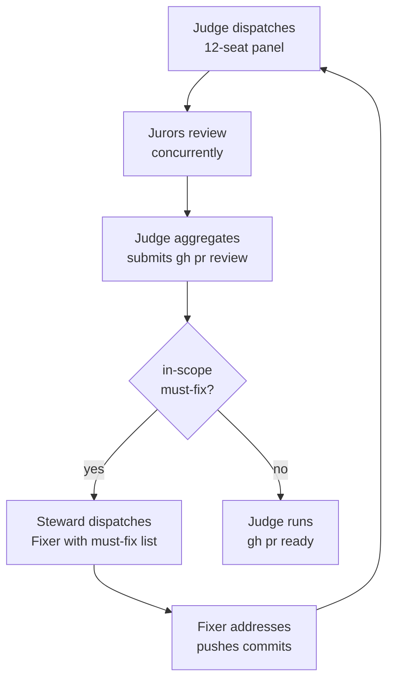
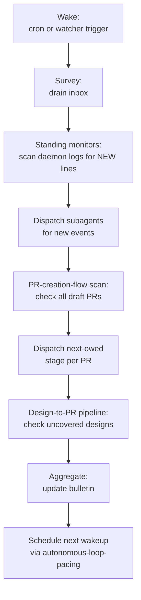
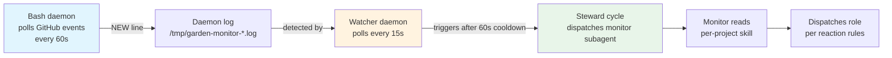
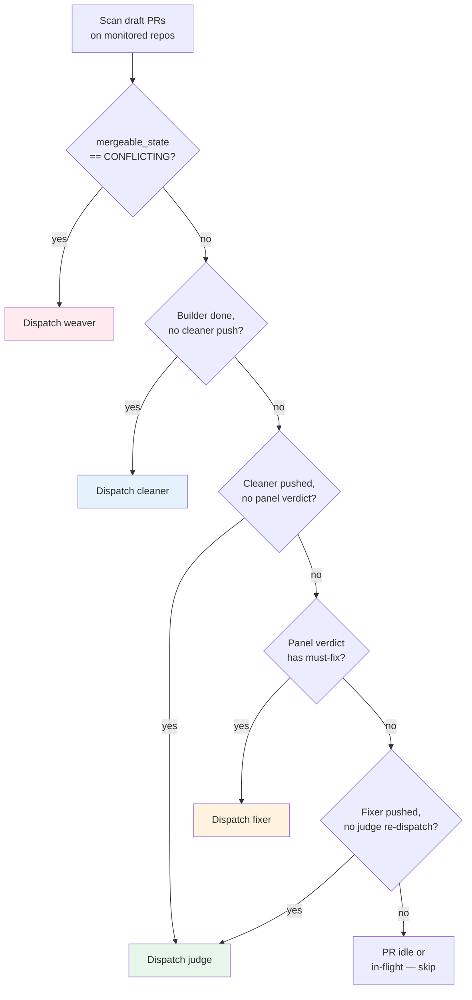
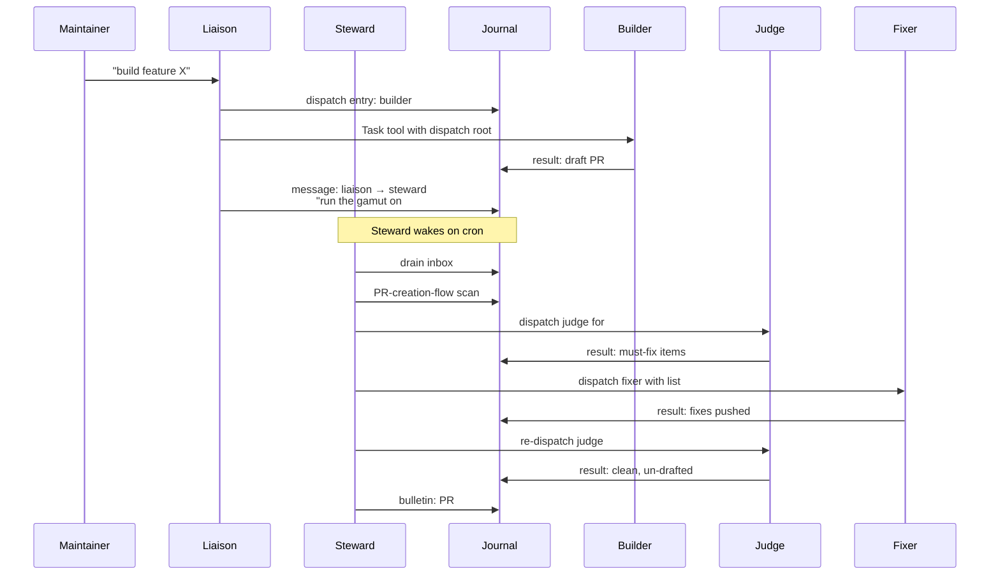
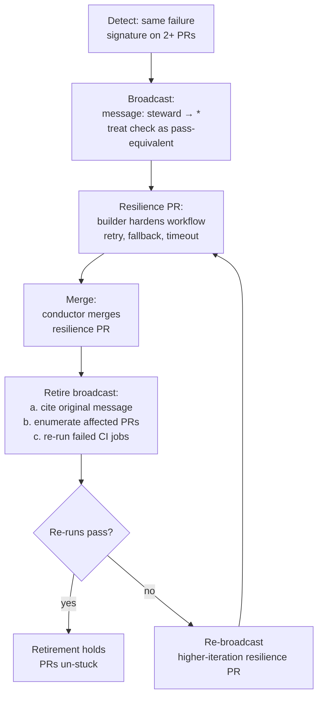
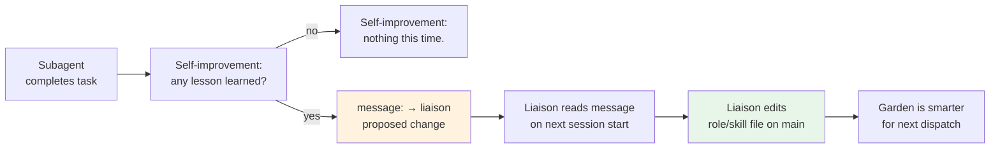

# The Garden of Bits

## How the Workflow Works

A technical guide to the garden's roles, mechanics, and autonomous loop

---

## What Is the Garden?

The garden is a **library of agent roles and skills** for working across many forks of GitHub repositories.

- **No application code** — only the artifacts that let agents dispatch focused subagents into worktrees
- **Roles** define *who* does the work (liaison, steward, builder, judge, fixer, ...)
- **Skills** define *how* to do it (journal-sync, panel-review, pr-creation-flow, ...)
- **The Journal** is the durable transcript and message bus between agents

---

## Two Postures, One Job

| | **Liaison** | **Steward** |
|---|---|---|
| **Authority** | Excess — asks before acting | Bounded — acts within constraints |
| **User** | In the loop | No user present |
| **Can edit** | Roles, skills, top-level docs | Only journal entries |
| **Triggers** | User request | Cron (30 min) + watcher daemon (~15-90s) |

The liaison and steward divide one job — orchestrating the garden — by **trust posture**.

---

## The Dispatch Contract

Every subagent runs in a **per-dispatch worktree triple**:

```
<dispatch-root>/
  garden/    # detached worktree of garden's main (read roles/skills)
  journal/   # detached worktree of journal branch (write entries)
  project/   # (when applicable) detached worktree of fork@branch
```

Created by `dispatch-prepare.sh`, torn down by `dispatch-teardown.sh`.
Each subagent reads `roles/COMMON.md` first, then its role file, then skills on demand.

---

## The Journal: Message Bus & Transcript

```
journal/entries/<YYYY>/<MM>/<DD>/<HHMMSS>Z-<kind>-<role>-<short-id>.md
```

**Entry kinds:**
- `dispatch` — a subagent was sent to work
- `tick` — a monitor or daemon reported activity
- `message` — inter-agent communication (`to: "steward"`, `to: "*"`)
- `result` — a subagent's report
- `worktree` — lifecycle events (create, heartbeat, collect)

The journal is a **git orphan branch** — independent of `main`, never merged.

---

## Part I: The Synchronous Flow



---

## The Builder

- Receives a spec (from designer or direct maintainer directive)
- Writes implementation + tests
- Opens a **draft PR** on the bot fork
- Does **not** un-draft — that authority belongs to the judge

The builder's job ends at "draft PR is open." The steward's PR-creation-flow scan picks up from there.

---

## The Cleaner

- Runs a **coverage-driven pass** on the new code
- Hunts **dead code** and unreachable paths
- Pushes coverage and cleanup commits
- Does **not** un-draft — pushes to the judge

Skipped on tiny PRs (docs-only, lockfile-only, single-line fix with test in diff).

---

## The Judge & The 12-Seat Code Panel

The judge is the **foreperson** — it does not review code itself. It dispatches:

| Seat | Focus |
|---|---|
| Assessor | Logic correctness, edge cases |
| Typist | TypeScript/JSDoc type accuracy |
| Stylist | Naming quality, gratuitous renames |
| Packager | Changeset discipline, commit splitting |
| Archivist | Documentation accuracy |
| Prover | Test completeness, regression evidence |
| Curator | Public API surface |
| Migrator | Migration path, backward compat |
| Locksmith | Security, capability boundaries |
| Warden | Error handling, invariants |
| Saboteur | Adversarial review, attack surface |
| Breaker | Stress testing, failure modes |

Each juror writes a per-juror block with verdicts: **must-fix**, **should-fix**, or **comment-only**.

---

## The Jury-Fixer Loop



The loop iterates until no in-scope must-fix remains.

---

## The Boatman

- Carries the bot-side PR **upstream** to the real repo
- Requires `identity_switch_authorized: true` (kriskowal credentials)
- Opens the upstream PR and **cross-links** it with the garden PR
- Only role authorized to use the maintainer's git identity
- Must run on the **credentialed host** (`kmkmbp2021`)

---

## Part II: The Autonomous Loop

---

## The Steward's Cycle



---

## Standing Monitors: Daemon + LLM Wake



The daemon uses **conditional HTTP requests** (ETag). 304 = no cost, no output.

---

## The Watcher Daemon

Replaces the original Claude Code `Monitor` parent-context tools:

- **Daemon-log watcher**: polls `/tmp/garden-monitor-*.log` every 15s for `NEW|ERROR` lines
- **Inbox drain**: runs `inbox-drain.sh steward` every 90s, triggers cycle if messages found
- **Cooldown**: 60s between triggers to prevent thrashing
- **Cron fallback**: every 30 minutes catches everything even if watcher dies

```
./garden watcher start    # background via nohup
./garden watcher status
./garden watcher stop
```

---

## The PR-Creation-Flow Scan

Each cycle, the steward checks every garden-authored draft PR:



---

## Concurrency Caps

| Cap | Rule |
|---|---|
| **One stage per PR per cycle** | A PR that just had its judge dispatched does not also get a fixer dispatch |
| **One cleaner across the estate** | Coverage passes are CPU-heavy; one in flight is enough |
| **One design-PR builder across the estate** | Design-to-PR pipeline capped at 1 to prevent dependency races |
| **One conductor across the estate** | Only one merge in flight at a time |

Rate-limit by deferring excess PRs to the next cycle.

---

## Inter-Agent Messaging



---

## The Understudy

A **bounded-authority peer** with a **user reachable** on the other end.

**Presence detection:**
- Presence file at `journal/presence/<host>/understudy.md`
- `status: present` + `last_heartbeat` bumped every ~90s
- Stale after 5 minutes (3× the Monitor cadence)

**Shunted work** (steward → understudy):
1. Investigator dispatches (investigation is resumable, benefits from user-reachability)
2. Journalist dispatches (bulletin maintenance, tolerates handoff)
3. Major-general per-PR fanout (20+ PRs partitioned into clusters)

**Stays with steward:** standing monitors, PR-creation-flow scan, boatman, conductor.

---

## Operational Flake Handling

When a CI check fails across multiple unrelated PRs for external reasons:



The retirement is a **transaction** — step 5c (re-runs) is part of it.

---

## Self-Improvement Loop

Every engagement ends with `skills/self-improvement/SKILL.md`:



Subagents **cannot** edit role/skill files themselves — their `garden/` worktree is ephemeral.

---

## The Bulletin: Maintainer Dashboard

`journal/README.md` is the maintainer's view into the garden:

- **PRs ready for review** — un-drafted PRs awaiting maintainer attention
- **Pending kriskowal reviews** — PRs where the maintainer is requested
- **PR backlog** — all open garden-authored PRs
- **Decisions needed** — items requiring maintainer judgment
- **Pre-staged authorizations** — permissions the steward can forward
- **Ongoing work** — active worktrees, monitors, dispatches

Agents **own** the bulletin: they post when items arise, clear when conditions resolve.

---

## Safety Constraints

| Constraint | Rule |
|---|---|
| **Monitoring** | Only repos gated against untrusted contributors are safe to monitor (prompt-injection hazard) |
| **External repos** | Subagents cannot comment, cross-link, or react on upstream repos without per-action authorization |
| **Identity** | Only the boatman can use kriskowal credentials; all other commits are bot-identity |
| **Meta-evolution** | Only the liaison can edit roles, skills, and top-level docs |
| **Boatman host** | Must run on the credentialed host; liaison refuses to dispatch from wrong host |

---

## Summary: The Garden's Two Rhythms

**Synchronous** (you ask, it happens):
> Maintainer → Liaison → Builder → Cleaner → Judge → Fixer-loop → Boatman → Upstream

**Asynchronous** (the garden keeps turning):
> Cron → Steward → Monitors → PR-creation-flow scan → Dispatch → Journal → Next cycle

The **journal** connects them: messages from the liaison reach the steward's inbox, results from subagents surface on the bulletin, lessons bubble up to role files.

---

## Questions?

The full documentation lives in the garden:

- `CLAUDE.md` — layout and dispatch contract
- `roles/<name>/AGENT.md` — role-specific instructions
- `roles/COMMON.md` — standing instructions for all subagents
- `skills/<name>/SKILL.md` — procedural playbooks
- `journal/README.md` — current state and bulletin
