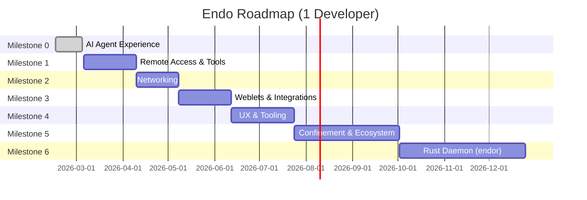

> Abstract: **Summary by Milestone** (after the 2026-05-08 recalibration): M0 Complete; M1 8-10 weeks (12 remaining), plus 10-12 weeks with review queue; M2 4-5 weeks (7 designs), 5-7 with queue; M3 5-7 weeks (9 designs), 6-9 with queue; M4 8-11 weeks (12 designs), 10-13 with queue; M5 14-20 weeks (6 active, 1 superseded), 16-22 with queue; M6 12-17 weeks (2 designs), 14-19 with queue. **Total remaining**: ~51-70 weeks effort, ~61-82 weeks including review queue. **Timeline** (gantt): M1 starts 2026-03-06; M2 after M1; M3 after M2; M4 after M3 (~6 weeks); M5 after M4 (~10 weeks); M6 after M5 (~12 weeks). **Critical path**: M0-M1-M2 (now M1-M2). M3 and M4 are less order-dependent and can be interleaved. M6 may run in parallel to later milestones once basic host scaffolding exists. **Strategic Early Items**: two EndoClaw capabilities surfaced before their later-milestone home — `endoclaw-timer` (M1; SES removes setTimeout/setInterval so Timer is the *only* mechanism for scheduled agent execution; prerequisite for proactive messages, monitoring, reminders) and `endoclaw-network-fetch` (M1; foundation for all external access; self-hosted agent without external HTTP is inert; OAuth + channel bridges + integrations depend on it).

### Timeline

Durations below are the recalibrated effort-side ranges (multiplying by the per-size ratios from the 2026-05-08 calibration round). Add ~2 weeks per milestone if the current review-queue depth persists.

| Milestone | Duration | Cumulative | Target Date |
|-----------|----------|------------|-------------|
| M0: AI Agent Experience | 18 days (actual) | **Complete** | March 5, 2026 |
| M1: Remote Access & Tools | 8-10 weeks | 8-10 weeks | Mid July 2026 |
| M2: Networking | 4-5 weeks | 12-15 weeks | Mid August 2026 |
| M3: Weblets & Integrations | 5-7 weeks | 17-22 weeks | Late September 2026 |
| M4: UX & Tooling | 8-11 weeks | 25-33 weeks | Late November 2026 |
| M5: Confinement & Ecosystem | 14-20 weeks | 39-53 weeks | Mid-Late March 2027 |
| M6: Rust Daemon (`endor`) | 12-17 weeks | 51-70 weeks | Q3-Q4 2027 |

*Milestones 3 and 4 are less order-dependent and can be interleaved. Milestones 0, 1, and 2 form the critical path. Weblets prioritized over UX polish (swapped 2026-03-06). M6 (Rust `endor`) is research-heavy and may run in parallel to later chat/UX milestones once basic host scaffolding is in place.*

### Strategic Early Items

Two EndoClaw capabilities are surfaced before the last two milestones because they are foundational rather than features:

| Design | Milestone | Rationale |
|--------|-----------|-----------|
| `endoclaw-timer` | M1 | **Core capability concern.** SES lockdown removes `setTimeout` and `setInterval`. Timer is the *only* mechanism for scheduled agent execution. Prerequisite for proactive messages, monitoring, reminders. Without it, agents are purely reactive. |
| `endoclaw-network-fetch` | M1 | **Foundation for all external access.** A self-hosted agent that cannot reach external APIs is inert. HttpClient with origin allowlist is the minimal network capability. OAuth, channel bridges, and all integrations depend on it. |

**Progress as of 2026-05-08**: 26 of 95 designs complete/implemented, 15 in progress. M0 complete. The 14 implementation PRs forwarded under the bot in the 2026-04-23/04-24 batch sit at a median 13.9 days open, so **review-queue latency rather than author throughput is the binding constraint on M1 completion**.

Source: [designs/README.md](https://github.com/endojs/endo-but-for-bots/blob/510630411ebc26a6d9327928b4d71e5155802ea4/designs/README.md) at commit `51063041` on branch `llm`.
