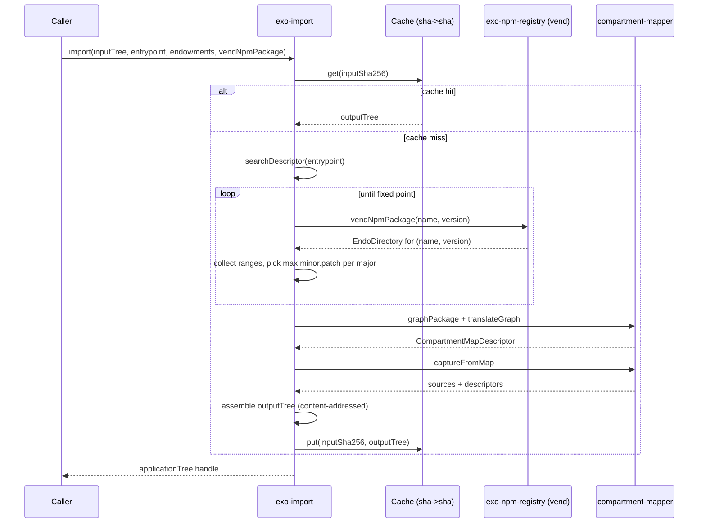

# exo-import

| Field | Value |
|------|------|
| Status | Draft |
| Author | designer |
| Created | 2026-05-14 |
| Updated | 2026-05-14 |
| Sibling | [exo-npm-registry](./exo-npm-registry.md) |

## Problem statement

The endo daemon platform needs a way to translate a program standing in a
(possibly virtual) filesystem snapshot into a linked, runnable application,
*without* doing Node.js-style filesystem-walking dependency resolution, *without*
consulting a lockfile, and *without* coupling the daemon to a live, mutable
working directory. The existing
[`mapNodeModules`](../packages/compartment-mapper/src/node-modules.js)
entry point on the compartment-mapper performs an exhaustive Node.js-conformant
walk of `node_modules`, expects a populated tree on disk, and bakes in
`node_modules` layout semantics. The daemon's working material is different:
content-addressed `EndoReadable` blobs and `EndoDirectory` virtual directories
([packages/daemon/src/types.d.ts](../packages/daemon/src/types.d.ts) lines 548
and 598), which are immutable by construction and addressed by sha512.

We want an importer whose inputs are a content-addressed snapshot of just the
entry package, plus a capability to look up the entry package's transitive
dependencies on demand from an npm-shaped registry. The resolution algorithm is
a deterministic function of the snapshot, so the resulting application tree is
also content-addressed and trivially cacheable.

## Scope

In scope:

- A new package `@endo/exo-import` exporting one async function that returns a
  handle to a linked-application readable tree.
- A deterministic, snapshot-only resolution algorithm modelled on Go modules'
  minimum-version selection in spirit, but maximum-version per major.
- Reuse of compartment-mapper primitives (`captureFromMap`, `link`,
  `translateGraph`-shaped descriptors) so all parsing, exports inference,
  policy hooks, subpath patterns, and archive semantics are inherited.
- A content-addressed cache keyed by input-tree sha256, vended into and out of
  exo-import by the daemon.

Out of scope: see [Non-goals](#non-goals).

## Non-goals

- **Not a Node.js drop-in.** Only the subset of packages that the
  compartment-mapper can confine in Compartments is supported. CommonJS-only
  packages, packages with native bindings, and packages with postinstall
  scripts are out.
- **Not git-version-aware.** Dependencies are addressed solely by `(name, version)`
  via the [exo-npm-registry](./exo-npm-registry.md) vend interface. No `git+`,
  `file:`, `link:`, or tarball-URL specifiers.
- **Not lockfile-driven.** There is no separate `package-lock.json` /
  `yarn.lock` / `pnpm-lock.yaml` consulted; the resolved set is recovered from
  the snapshot's `package.json` files alone, by construction.
- **No mutation of the input tree.** The input snapshot is immutable; the
  output is a new readable tree.

## Inputs and outputs

```ts
interface ExoImportInputs {
  // The content-addressed snapshot containing the entry package.
  // Typically an EndoReadable directory tree; identified by its sha256.
  inputTree: EndoDirectory;

  // The name-path to the entry module, relative to the input tree's root.
  // Resolves to the entry package's "main" or an explicit subpath.
  entrypoint: string;

  // Capabilities the linked application may receive at execute time.
  // Passed through unchanged to the resulting application's main compartment.
  endowments: Record<string, unknown>;

  // Lookup capability for npm-vendable packages, by version vector.
  // This is EXACTLY the vend API exported by exo-npm-registry; see
  // ./exo-npm-registry.md.
  vendNpmPackage(name: string, version: string): Promise<EndoDirectory>;
}

interface ExoImportCache {
  get(inputSha256: string): Promise<EndoDirectory | undefined>;
  put(inputSha256: string, outputTree: EndoDirectory): Promise<void>;
}

interface ExoImportOutputs {
  // Content-addressed; the daemon can stash, share, or feed to a worker.
  applicationTree: EndoDirectory;
  applicationSha256: string;
}
```

## Design

### Snapshot strictness invariant

The whole mechanism operates on *snapshots*. The input `EndoDirectory` is
addressed by sha256 and is, by construction, immutable; same for every
`(name, version)` tree the vend API returns; same for the output
`applicationTree`. exo-import never reads from a live, mutating filesystem. If
a caller wants to import "the working directory", the caller snapshots first
(via the daemon's directory-snapshot primitive) and passes the resulting
content-addressed handle. This is a hard invariant: violating it would
invalidate the cache key.

### Cache

The cache maps `inputSha256 -> outputSha256` (or, more usefully, the
`EndoDirectory` handle for the output tree). Because resolution is
deterministic in the input snapshot, the cache hit semantically replaces the
entire body of exo-import. The cache is supplied by the caller; the daemon
typically vends the same cache instance to many import calls so applications
linked from common inputs share an output blob.

### Resolution algorithm: maximum-version-per-major selection

Modelled on Go modules' selection rule, but maximum-selection rather than
minimum-selection:

1. Walk the transitive dependency graph from the entry package's `package.json`,
   visiting each `(name, range)` pair recorded in `dependencies`,
   `peerDependencies`, `optionalDependencies`. (devDependencies are ignored
   unless the caller opts in.)
2. For each dependency name, collect every range string mentioned anywhere in
   the graph.
3. For each `(name, major)` bucket reachable in the graph, *pick the largest
   `minor.patch` mentioned in any range in that major's bucket*. (If a range
   like `^1.2.3` is mentioned and no other dep pins a more specific minor.patch
   in the `1.x` major, the pin is `1.2.3`. See
   [Open questions](#open-questions) on edge cases.)
4. For each selected `(name, major.minor.patch)`, call
   `vendNpmPackage(name, version)` to retrieve a content-addressed
   `EndoDirectory` for that exact release.
5. Splice each vended tree into the output tree at a stable location keyed by
   `(name, major)`. The daemon's virtual-directory layout (see
   [exo-npm-registry](./exo-npm-registry.md) § Virtual directory layout) lets
   the splice be a tree-handle reference, not a copy.
6. Feed the assembled tree to the compartment-mapper's `mapNodeModules` or
   `captureFromMap` to obtain the linked application descriptor; the
   compartment-mapper does NOT walk a live `node_modules` because the spliced
   tree already presents one synthetic `node_modules` per major.
7. The resulting compartment map and the assembled tree together are the
   output tree.

The "exactly one minor.patch per major per package" property is what makes
resolution converge without a lockfile: it falls out of (2) and (3) being
pure functions of the snapshot.

### Selecting the modules

Go-style pseudocode:

```text
function selectModules(snapshot, vendNpmPackage):
  ranges := {}                          # (name, major) -> set of range strings
  queue := [(rootPackageJsonOf(snapshot), rootPackageOrigin)]
  seenPackageJsons := {}

  while queue not empty:
    (pkgJson, origin) := pop(queue)
    if pkgJson.id in seenPackageJsons: continue
    seenPackageJsons[pkgJson.id] := true

    for (name, range) in dependenciesOf(pkgJson):
      major := majorOf(range)           # error if range is unbounded or git
      ranges[(name, major)] := ranges[(name, major)] ∪ {range}

  selected := {}                        # (name, major) -> exact "major.minor.patch"
  for (name, major), rangeSet in ranges:
    candidates := unionOfMentionedMinorPatch(rangeSet)
    selected[(name, major)] := max(candidates)   # SemVer-aware max

  for (name, major), version in selected:
    tree := await vendNpmPackage(name, version)
    walkAndEnqueueDeps(tree, queue)            # discover new (name, range)
    # iterate to fixed point; the universe is finite because every dep is
    # confinable-only and confinable packages do not loop indefinitely.

  return selected
```

The loop iterates to a fixed point: vending a dep can expose new dependency
ranges, which can raise the selection for some `(name, major)` bucket, which
can shift downstream selections. Termination follows because each iteration
either grows the seen set or refines a selection upward, both of which are
bounded.

### Use of compartment-mapper primitives

Instead of `mapNodeModules`, exo-import:

- Reuses `searchDescriptor` (from
  [packages/compartment-mapper/src/search.js](../packages/compartment-mapper/src/search.js))
  to locate the entry package.json inside the input snapshot.
- Reuses `graphPackage` / `translateGraph` (in
  [packages/compartment-mapper/src/node-modules.js](../packages/compartment-mapper/src/node-modules.js))
  to construct the `CompartmentMapDescriptor` once the synthetic
  `node_modules` is assembled.
- Reuses `captureFromMap` (in
  [packages/compartment-mapper/src/capture-lite.js](../packages/compartment-mapper/src/capture-lite.js))
  to assemble the sources and pattern-replacement metadata.
- Inherits subpath-pattern handling for `exports`/`imports` from
  [the subpath-pattern-replacement design](../packages/compartment-mapper/designs/subpath-pattern-replacement.md).

### Sequence



## Alternatives considered

- **Lockfile-driven (npm / yarn classic / pnpm).** Rejected: requires a
  separate lockfile artifact the snapshot doesn't necessarily carry. The
  selection-from-ranges algorithm gives equivalent determinism for the
  confinable subset.
- **pnpm-style content-addressed store with per-symlink resolution.**
  Rejected: depends on filesystem symlinks, which the snapshot abstraction
  does not preserve across the readable-tree boundary; conflates with the
  daemon's separate content-addressed substrate.
- **Node.js exhaustive `node_modules` walk (mapNodeModules' current shape).**
  Rejected by problem statement: requires a populated `node_modules` tree on
  disk and Node.js layout semantics; exo-import's input is a snapshot of the
  entry package only.
- **Minimum-version selection (Go modules proper).** Considered. The
  maintainer's framing prefers the *largest* minor.patch mentioned anywhere
  for each major, presumably to converge on the most-recently-secured patch
  set. Go's minimum-selection optimises for reproducibility across time;
  exo-import optimises for "use the highest already-mentioned patch" given
  that resolution is rerun on every snapshot change anyway.

## Test plan

- **Unit: range collection and selection.** Given a synthetic graph of
  `(name, range)` tuples, verify the selector picks the documented max
  minor.patch per major. Cover `^`, `~`, exact pins, and prerelease ranges.
- **Unit: fixed-point termination.** Construct a graph where vending a dep
  introduces new ranges that raise the selection on a previously-vended dep;
  verify a second pass converges and re-vends the higher version.
- **Integration: cache hit path.** Same input snapshot, two import calls;
  verify the second call returns without consulting the vend API.
- **Integration: snapshot strictness.** Verify that mutating the underlying
  filesystem after snapshotting does not change the import result (the input
  is content-addressed).
- **Parity-bounded: compartment-mapper features.** Verify that subpath
  patterns, policy enforcement, and conditional exports work identically to
  the `mapNodeModules` path on equivalent inputs.
- **Negative: unsupported dependency shape.** Verify the import fails with a
  diagnostic when a transitive dep declares a `git+` specifier, a postinstall
  script, or a CJS-only main without a compartment-mapper-compatible parser.

## Open questions

1. **Range with no other anchoring mention.** If `package.json` declares
   `"lodash": "^4.17.0"` and no other package in the graph mentions any
   `lodash@4.x` version, what's the selection? Options: (a) take `4.17.0`
   literally (the lower bound); (b) call out to the registry's "latest in
   range" resolver and select `4.17.{whatever}`; (c) error. The design
   currently implies (a) because "largest minor.patch mentioned anywhere"
   degenerates to the lone mention.
2. **Cache invalidation on republish.** `(name, version)` is *supposed* to be
   immutable in npm, but malicious republishes happen. Does the cache key
   include the vended tree's sha256, or only the input snapshot's? If only
   the input's, a republished dep can poison the cache for an unchanged
   snapshot. Recommendation, to confirm: extend the cache key to a content
   hash of the resolved-tree manifest.
3. **Who vends the exo-import capability?** Does `@endo/exo-import` export a
   top-level function the daemon imports directly, or does the daemon
   formulate an `exo-import` object (akin to its
   [`readable-blob` formula](../packages/daemon/src/daemon.js)) and pass
   handles around? The latter scales for cross-network use; the former is
   simpler.
4. **Failure mode for unsupported deps.** When a transitive dep needs a
   feature outside the compartment-mapper's reach (CJS-only,
   native bindings, postinstall), should the import abort, warn-and-skip, or
   delegate to a fallback exit-module mechanism? The compartment-mapper's
   existing exit-module hooks suggest the third; the design needs the
   maintainer's preference.
5. **Prerelease and range semantics.** `^1.2.3-beta.0` matches what? Go
   modules treat prereleases distinctly; npm semver does too but differently.
   We need a single rule, expressed in the test plan.
6. **devDependencies opt-in shape.** Some imports need dev deps (test
   fixtures bundled into the snapshot); some never do. Is this a flag on the
   import call or a property of the entrypoint?

See [exo-npm-registry](./exo-npm-registry.md) for the vend interface this
design assumes, and [its open questions](./exo-npm-registry.md#open-questions)
for registry-side ambiguities that bear on resolution.
