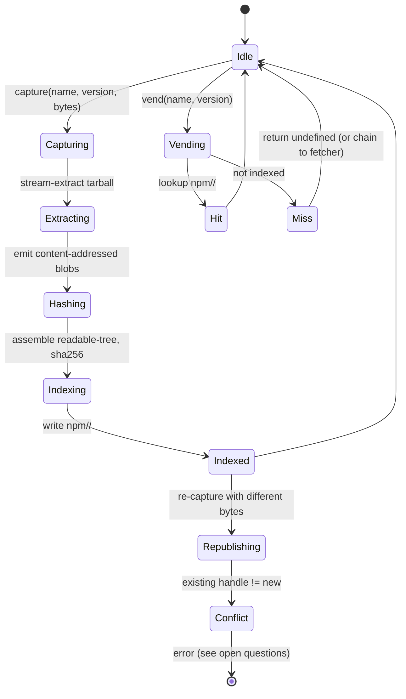

# exo-npm-registry

| Field | Value |
|------|------|
| Status | Draft |
| Author | designer |
| Created | 2026-05-14 |
| Updated | 2026-05-14 |
| Sibling | [exo-import](./exo-import.md) |

## Problem statement

[exo-import](./exo-import.md) accepts a content-addressed readable-tree
snapshot and one inbound capability: a vend interface that, given
`(packageName, version)`, returns an `EndoDirectory` for that exact npm
release. Something has to *fulfil* that capability: fetch the npm release
once, extract it into a daemon-shaped readable tree, index it under
`(name, version)`, and vend it back on demand. That something is
`@endo/exo-npm-registry`.

The wire to the public npm registry (HTTPS to `registry.npmjs.org`, an
internal mirror, a pre-populated content-addressed cache, an offline shelf,
etc.) is a concern of the daemon-platform integrator, not of this package.
This design describes the capability shape and the daemon-side index, not
the fetcher.

## Scope

In scope:

- A `capture` API that, given `(name, version)` and a tarball-bytes source,
  produces a content-addressed `EndoDirectory` and indexes it under
  `(name, version)` in a daemon virtual directory.
- A `vend` API that, given `(name, version)`, returns the indexed
  `EndoDirectory`. This is the exact shape exo-import names as its
  `vendNpmPackage` input.
- A virtual-directory layout in the daemon under which captures are stored
  and addressed.
- An indexing scheme that maps `(name, version)` to a readable-tree handle,
  with content-addressed dedup at the file level so identical files across
  versions are stored once.

Out of scope:

- The fetcher itself (HTTPS, mirror, etc.); integration receives raw tarball
  bytes from wherever.
- Range resolution (e.g., turning `^1.2.3` into a concrete version); that is
  exo-import's job.
- Cryptographic signature verification of npm packages; orthogonal, may be
  layered atop the capture API.

## Inputs and outputs

```ts
interface ExoNpmRegistry {
  // Capture: ingest one (name, version) given its tarball bytes.
  // Idempotent in (name, version, tarballSha256); a second capture of
  // identical bytes is a no-op.
  capture(
    name: string,
    version: string,
    tarballBytes: AsyncIterable<Uint8Array>,
  ): Promise<EndoDirectory>;

  // Vend: return the previously-captured tree for (name, version), or
  // undefined if not captured. The capability passed into exo-import wraps
  // a flavour of vend that throws on miss (or chains to a fetcher).
  vend(name: string, version: string): Promise<EndoDirectory | undefined>;

  // Enumerate what is currently indexed; useful for daemon admin and for
  // saboteur-style supply-chain audits.
  list(name?: string): AsyncIterable<{ name: string; version: string; sha256: string }>;
}
```

## Design

### Virtual directory layout

The daemon already exposes content-addressed readable blobs (the
[`readable-blob` formula](../packages/daemon/src/daemon.js) and the
[`EndoReadable` / `EndoDirectory` interfaces](../packages/daemon/src/types.d.ts)).
The registry lives as a single `EndoDirectory` rooted at a well-known pet name
(suggested: `npm`) under the daemon's directory tree:

```
npm/
  <name>/
    <version>/         -> EndoDirectory snapshot of that release's tree
                          (the "extracted tarball minus npm cruft")
```

Each `<version>` entry is a readable-tree handle whose sha256 (or sha512) is
the content address of the entire extracted tree. The handle is what `vend`
returns. The same handle can be referenced from many places without
duplication: the daemon's content-addressed store deduplicates underlying
blobs.

### Capture

Capture takes the npm tarball bytes (the integrator supplies them; this
package does not fetch). The procedure:

1. Stream-extract the tarball into a tree builder, dropping npm-specific
   noise (`.npmignore`, the `.gitignore` from the source if present in the
   tarball, `package-lock.json` if present, anything under `node_modules/`
   if a publisher accidentally shipped one).
2. Each regular file becomes a content-addressed blob in the daemon's store.
3. The directory tree referencing those blobs is itself
   content-addressed; that sha is the version's readable-tree handle.
4. Write `npm/<name>/<version>` to point at the new handle (idempotent: a
   pre-existing identical entry is left alone; an existing entry with
   different content is an error, see [Open questions](#open-questions)
   on republish handling).
5. Return the handle.

### Indexing

The index is the directory tree itself: lookups `vend(name, version)` reduce
to a name lookup on `npm/<name>/<version>` via the existing
`NameHub.lookup(petNamePath)` machinery
([packages/daemon/src/types.d.ts](../packages/daemon/src/types.d.ts) line
540). No separate index file; the daemon's directory data structure *is*
the index. This is the "directory layout doubles as catalog" choice
discussed in [Alternatives considered](#alternatives-considered).

### Content-addressed dedup

Many npm releases share files byte-for-byte across versions (LICENSE,
unchanged source files, identical README). Because each file becomes a
content-addressed blob, identical files across `(name, v1)` and `(name, v2)`
reference the same underlying blob. The daemon's existing content-addressed
substrate handles this for free.

### Integration point with exo-import

The `vend(name, version)` API IS the `vendNpmPackage` capability that
[exo-import](./exo-import.md#inputs-and-outputs) names. Concretely, the
daemon hands exo-import a closure equivalent to:

```js
async function vendNpmPackage(name, version) {
  const tree = await registry.vend(name, version);
  if (!tree) throw Error(`Not in registry: ${name}@${version}`);
  return tree;
}
```

A registry instance can also wrap a fetcher: if `vend` misses, it asks the
fetcher for the tarball bytes, calls `capture`, then returns the resulting
handle. exo-import does not need to know whether vend is satisfied from
cache or fetched on demand.

### State diagram



## Alternatives considered

- **Separate in-memory index keyed by (name, version).** Rejected: the daemon
  already has a persistent name-hub data structure; a parallel index would
  duplicate persistence, recovery, and serialization concerns.
- **On-disk SQLite-style index.** Rejected for the same reason; the daemon's
  directory tree is the natural index. Reach for SQLite only if `list()`
  or range queries become hot, which they are not on the exo-import path.
- **Per-file content-addressed dedup explicit.** Considered. The daemon
  substrate gives us file-level dedup for free; we do not need a separate
  dedup index. We DO need to ensure capture emits one content-addressed blob
  per regular file so the substrate sees them and dedups.
- **Snapshot the registry as one big EndoDirectory per `<name>`.** Rejected:
  forces re-hashing of the entire `<name>` subtree whenever a new version is
  captured. The per-version directory keeps captures O(version size).
- **Vend by sha256 instead of `(name, version)`.** Considered. The
  `(name, version)` API is what exo-import names; `vendBySha256` is a
  reasonable orthogonal accessor and may show up as a second method. See
  [Open questions](#open-questions).

## Test plan

- **Unit: capture is idempotent in bytes.** Capture the same tarball bytes
  twice and verify the second call returns the same handle without
  re-hashing.
- **Unit: capture drops noise.** Given a tarball that includes
  `node_modules/` or a `.gitignore`, verify the captured tree omits them.
- **Unit: file-level dedup.** Capture two versions sharing a LICENSE file
  byte-for-byte; verify the LICENSE blob is stored once in the substrate.
- **Integration: vend after capture.** Capture `lodash@4.17.21`; vend it;
  verify the handle's sha256 matches the captured handle's sha256.
- **Integration: list reports captured versions.** After capturing several
  `(name, version)` pairs, verify `list()` enumerates them. Verify
  `list(name)` filters correctly.
- **Adversarial: tarball with absolute paths.** A tarball whose entries
  carry absolute paths or `..` must be rejected. (Standard tarball-extract
  hardening, but the test belongs in this package.)
- **Adversarial: tarball with a symlink.** Symlinks in the tarball must be
  rejected or normalised; the readable-tree abstraction does not carry
  symlinks across the snapshot boundary.
- **Compatibility: exo-import end-to-end.** Capture three real-world npm
  releases (small, dependency-free); call exo-import with an entry package
  whose snapshot depends on them; verify exo-import resolves and links.

## Open questions

1. **Republish conflict policy.** npm permits unpublishing within 72 hours
   and (rarely) re-publishing the same version with different bytes. The
   state diagram shows the conflict edge as an error. Is that the desired
   default, or should the registry silently take the latest bytes? Errors
   are safer; but a malicious upstream can wedge a daemon if errors block.
2. **Vend-on-miss chaining.** Should `vend` always return undefined on miss
   and leave fetcher chaining to the integrator, or should the registry
   expose a `withFetcher(fetcher) -> ExoNpmRegistry` decorator? The
   decorator is more testable; the always-undefined shape is simpler.
3. **Tarball provenance verification.** npm publishes signatures
   (provenance attestations) for many packages. Is verifying them part of
   the capture API, a layer above, or out of scope? The integrator might
   reasonably want to reject unsigned captures.
4. **Garbage collection.** When a daemon's registry has captured 10,000
   versions and only 50 are still referenced by any linked application,
   what triggers GC? exo-import's content-addressed cache pins outputs,
   but the registry itself has no caller-side pin. A `prune(predicate)` or
   a refcount kept by exo-import are both viable; the design needs one
   answer.
5. **Vend-by-sha256 as a separate accessor.** Should `ExoNpmRegistry`
   expose `vendBySha256(sha)` in addition to `vend(name, version)`? It
   bypasses the name index for callers (e.g., exo-import's cache reload
   path) that already have the content address.

See [exo-import § Open questions](./exo-import.md#open-questions) for
ambiguities on the resolution side that intersect this package, especially
question 2 (republish-driven cache poisoning).
