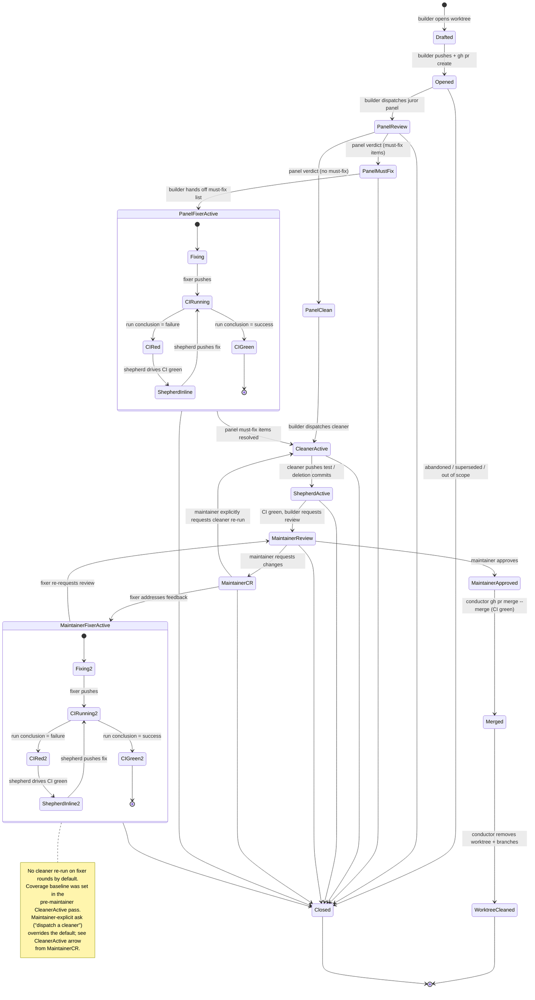

# Roles

A "role" is a posture an agent takes for a particular task.
Each file in this directory describes one role, lists the skills
that role draws on, and explains when to enter the role.

A single agent dispatch will usually map to one role; a long-running
steward orchestrates many across cycles.

The roles below are not exclusive.
A juror responding to feedback on a panel they themselves ran is
playing both `juror` and `fixer`; consult both.

## Index

- [botanist.md](./botanist.md) — review a single Dependabot PR
  (read lockfile diff, install with scripts disabled, read source
  + release notes + CVE feed, embargo by default for non-vuln-fix
  upgrades); record per-PR posture in
  [`../process/dependabotany.md`](../process/dependabotany.md).
- [builder.md](./builder.md) — implement a change from an issue or
  spec and get it through CI.
- [chronicler.md](./chronicler.md) — observe and catalogue
  documentation gaps (JSDoc, code comments, READMEs, tutorials)
  per PR or per package; maintain `process/doc-debt/<package>.md`
  and `process/doc-debt/QUEUE.md`. Hands off to the
  [`scribe`](./scribe.md) for the actual writing.
- [cleaner.md](./cleaner.md) — maximize coverage on a target
  package; write tests for reachable code or delete unreachable
  code.
- [conductor.md](./conductor.md) — drain the steward's merge
  queue one PR at a time: rebase, tidy, validate CI, merge,
  clean up the PR's worktree and branch.
- [designer.md](./designer.md) — expand a short prompt into a full
  `designs/*.md` document.
- [director.md](./director.md) — the steward's per-cycle per-PR
  dispatch sweeper; applies the dispatch matrix and enqueues
  the conductor.
- [juror.md](./juror.md) — conduct a review of someone else's
  PR, alone or as part of a panel.
- [fixer.md](./fixer.md) — address review feedback on an
  open PR.
- [groom.md](./groom.md) — maintain the roadmap in
  `designs/README.md`: recalibrate estimates, re-project
  milestones, refresh the dependency graph.
- [triager.md](./triager.md) — classify or audit a batch of issues
  or PRs, build navigation aids.
- [investigator.md](./investigator.md) — investigate code or repo
  hygiene (TODOs, AST coverage, rebase state) across the tree.
- [liaison.md](./liaison.md) — manage issues on
  endo-but-for-bots: read every contributor comment, reply
  with the action taken, track per-issue posture under
  `process/tracking/<N>.md`.
- [major-general.md](./major-general.md) — proactive scout for
  major-version upgrades to direct dependencies; reads migration
  guides and opens adoption PRs (with changesets only when the
  change is observable downstream); records per-package posture in
  [`../process/major-generalship.md`](../process/major-generalship.md).
  Complement of the [botanist](./botanist.md), which gates each
  upgrade at merge.
- [marshal.md](./marshal.md) — the steward's per-cycle
  design-pipeline pick-next; owns the continuous-occupancy
  invariant for design-builders.
- [namer.md](./namer.md) — choose a name (function, package,
  flag, branch) against the project's house naming guide.
- [saboteur.md](./saboteur.md) — propose gotcha test cases that
  attack a module's claimed invariants.
- [scout.md](./scout.md) — investigate a performance
  tradeoff with numbers.
- [scribe.md](./scribe.md) — land documentation work the
  [`chronicler`](./chronicler.md) prioritized: JSDoc, code-comment
  fixes, README refreshes, tutorials. Doc-side analog of
  builder/fixer.
- [shepherd.md](./shepherd.md) — keep CI healthy across many
  in-flight PRs.
- [steward.md](./steward.md) — top-level per-cycle coordinator;
  consults the watchmen, dispatches director, liaison, marshal,
  groom, and conductor; aggregates their reports into `process/`
  state.
- [stratego.md](./stratego.md) — own the upstream-port plan;
  cluster llm-vs-master substance into a linear stack proposal,
  iterate as both branches advance.
- [watchman-cadence.md](./watchman-cadence.md) — owns the
  steward's `ScheduleWakeup` call site and the
  cache-window-aware delay rules; inline subsection of the
  steward's per-cycle close. See
  [`../designs/watchmen.md`](../designs/watchmen.md).
- [watchman-events.md](./watchman-events.md) — owns the GitHub
  events poll daemon contract, Monitor arming, and post-wake
  routing; inline subsection of the steward's per-cycle sweep.
  See [`../designs/watchmen.md`](../designs/watchmen.md).
- [watchman-schedule.md](./watchman-schedule.md) — owns the
  calendar of date-keyed engagements via
  [`../process/scheduled-engagements.md`](../process/scheduled-engagements.md);
  inline subsection of the steward's per-cycle sweep. See
  [`../designs/watchmen.md`](../designs/watchmen.md).
- [weaver.md](./weaver.md) — rebase or merge a branch onto a
  fresh base; resolve conflicts by reading both sides.

The skill files are at [`../skills/`](../skills/).
Each role file references skills by relative path so an agent in the
role can read them inline.

## How roles compose

The state machine below sketches the typical hand-off chain across a
PR lifecycle.
It is descriptive, not normative: the role files themselves are the
source of truth, and an agent in any role should read its own role
file before relying on this diagram.
Auxiliary flows that are not PR-shaped (the per-cycle steward
dispatch, the documentation lane) are summarised in prose after the
state machine.

### Per-PR state machine

A PR moves through a small set of states from open to merged.
Each transition is annotated with the role responsible.
The maintainer never sees a red-CI PR: every bot-side change between
the initial build and maintainer approval is followed by a shepherd
that drives CI to green before review is requested.
The cleaner runs exactly once, as the last bot-side preparation step
before the maintainer's first look; it does not re-run during the
fixer / maintainer review loop.
The sad-path (`Closed`) is reachable from any pre-merge state.

Notes on the state machine:

- The pre-maintainer chain is
  builder → panel → (fixer-if-must-fix) → cleaner → shepherd →
  maintainer review.
  The cleaner is the LAST bot-side preparation step.
  The maintainer should see a CI-green, panel-vetted, coverage-cleaned
  PR on the first look.
- The maintainer-review loop is fixer → shepherd → re-request review.
  No cleaner re-run by default.
  The cleaner already established a coverage baseline; small fix-up
  changes do not warrant a fresh package-wide pass and dispatching a
  cleaner mid-loop races the next maintainer review.
  **Exception:** the maintainer may explicitly request a cleaner
  re-run inside a `CHANGES_REQUESTED` review (phrasings like
  "dispatch a cleaner then a shepherd to maximize coverage on
  `<package>`").
  When that happens, MaintainerCR transitions back to CleanerActive
  rather than to MaintainerFixerActive; the cleaner runs again, then
  hands off to the shepherd per the canonical pre-maintainer chain.
  Encountered on PR #122 (2026-05-09): kriskowal asked for a cleaner
  re-run, coverage moved from 87.6% to 96.6%.
- `CIRunning` / `CIRed` / `CIGreen` / `ShepherdInline` are nested
  inside both `PanelFixerActive` and `MaintainerFixerActive` because
  every fixer push triggers fresh CI and may require a shepherd to
  chain-fix red runs.
  The same nested loop applies to the builder's first push and to
  the cleaner's push, but those CI dances are short enough that the
  diagram folds them into a single `ShepherdActive` step.
- The cleaner is conditional.
  Pure docs, lockfile-only churn, a one-file Prettier sweep, or a
  single bug-fix line whose test fixture is already in the diff goes
  straight from `PanelClean` (or post-fixer) to `ShepherdActive`,
  skipping `CleanerActive`.
- The conductor merges only when CI is green at merge time.
  Per maintainer directive 2026-05-08 (kriskowal on PR #157): "the
  conductor should only merge changes that are passing in CI."
- A `MaintainerReview` outcome of `MaintainerCR` re-enters the
  fixer loop; the same PR may cycle through fixer / maintainer rounds
  several times before landing.
- `Closed` is the terminal sad-path: maintainer, contributor, or
  steward decision to abandon, supersede, or rule out of scope.
  No state machine arrow leads back out of `Closed` (per
  [`../CLAUDE.md`](../CLAUDE.md): closed PRs are inert).

### Per-cycle steward dispatch

The steward runs as a continuous local loop and fires sub-roles in
parallel on every kick or loop tick.
Three sub-roles are always dispatched in parallel: the
[`director`](./director.md) (per-PR dispatch sweep), the
[`liaison`](./liaison.md) (issue-side scan), and the
[`marshal`](./marshal.md) (design pick-next).
Two more are conditional on cycle state: the [`groom`](./groom.md)
fires when a PR merged this cycle or the marshal returned a
needs-groom-first verdict, and the [`conductor`](./conductor.md)
fires when the merge queue is non-empty and no conductor is already
in flight.
The steward then appends a cycle log, rewrites
`process/PR-DISPATCH-STATE.md`, commits and pushes process state, and
schedules the next wakeup.
See [`./steward.md`](./steward.md) for the full procedure.

### Documentation lane

Documentation work follows the same panel-and-fixer chain as code
work, but uses a doc-side role pair: the
[`chronicler`](./chronicler.md) observes documentation gaps (JSDoc,
code comments, README drift) and maintains
`process/doc-debt/QUEUE.md`; the [`scribe`](./scribe.md) picks items
off that queue and lands the writing as a doc PR.
The chronicler / scribe pair is the doc-side analog of the panel /
fixer pair on the code side.
A doc-only PR runs the same per-PR state machine above; the panel's
slot 11 (Documentation / metadata) covers the shallow check, and the
chronicler may be dispatched as the deeper slot-11 variant when the
diff is doc-shaped.

### Other roles

Several roles do not appear in the per-PR happy path but participate
in the broader workflow:

- The [`liaison`](./liaison.md) handles every issue comment.
  It does not dispatch other roles directly; it surfaces needs (a
  designer for a new design, a builder for a clear bug fix) to the
  steward via the cycle log.
  When work surfaces and a sub-role of the right shape is
  appropriate, the steward dispatches in the current cycle or
  queues an explicit pending-dispatch entry in
  `process/PR-DISPATCH-STATE.md`.
- The [`weaver`](./weaver.md) is dispatched by the director when a
  PR is behind base, and by the steward in the rare case of a
  garden upstream merge from `actual/llm`.
  The conductor does its own short rebases inline; the weaver is
  the escalation path when conflicts need both-sides reading.
- The [`shepherd`](./shepherd.md) is dispatched by the director on
  red CI in scope (chain-fixing, single-package), or invoked
  inline by the fixer during a fix-up round.
  Per maintainer directive 2026-05-08, the shepherd is invoked after
  every bot-side change between build and maintainer approval.
- The [`scout`](./scout.md) is dispatched by the director when a
  reviewer asks for a benchmark.
- The [`saboteur`](./saboteur.md) (test-writing variant) is
  dispatched explicitly when a maintainer asks to "stress-test the
  invariants on `<module>`".
  It is distinct from the panel's slot 13 adversarial juror, which
  is part of every builder-handed-off panel.
- The [`triager`](./triager.md), [`investigator`](./investigator.md),
  and [`namer`](./namer.md) are user-initiated, lightweight, and
  generally do not dispatch other roles.
  Their outputs feed back to the user or to the steward as
  recommendations.
- The [`stratego`](./stratego.md) iterates on
  `process/STRATEGO-PLAN.md` across cycles, planning the
  upstream-port stack.
  It does not author the stack; another role (typically a builder
  dispatched against the stack) does.

## Self-improvement

Every role's final task is the same: update its own role file and
any cited skills with what was learned during the engagement.
See [`../skills/self-improvement.md`](../skills/self-improvement.md)
for thresholds and discipline.
This is what keeps the role and skill libraries useful instead of
drifting from reality.
